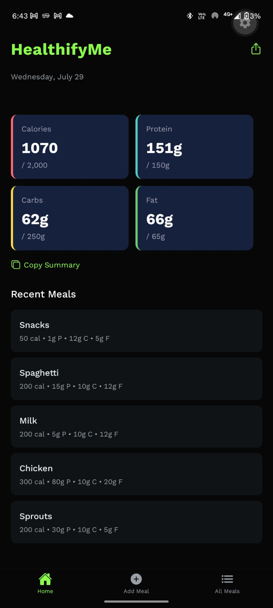
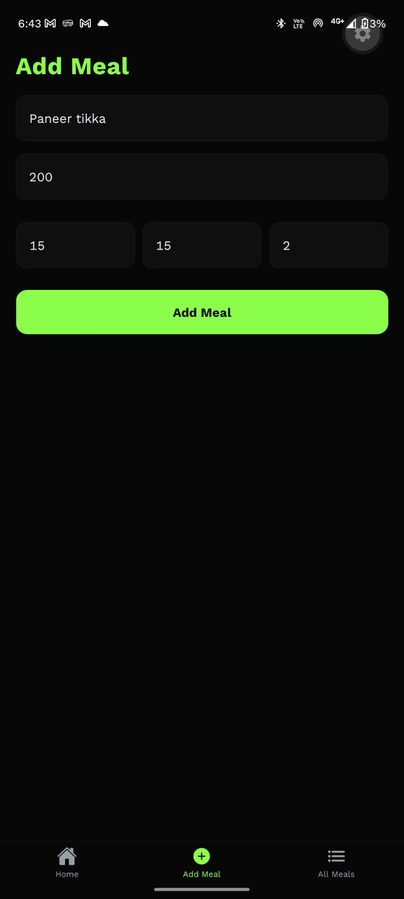
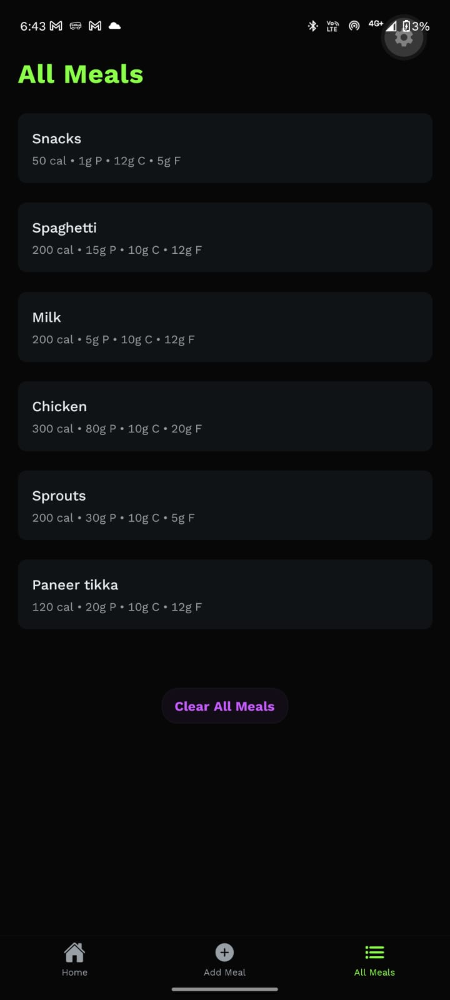
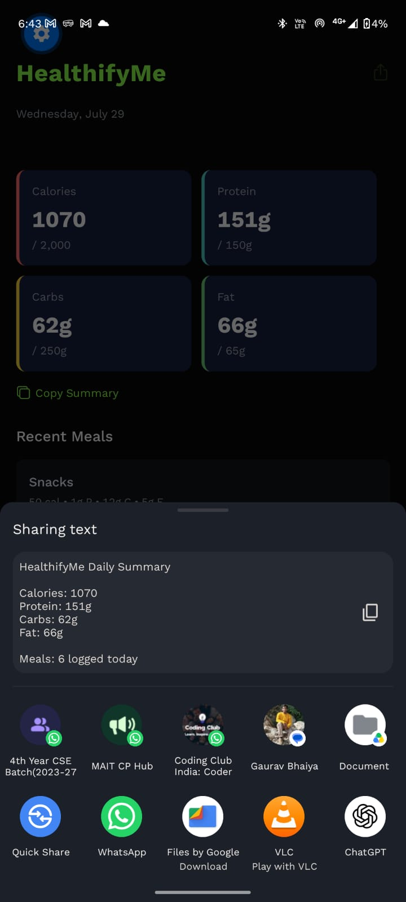
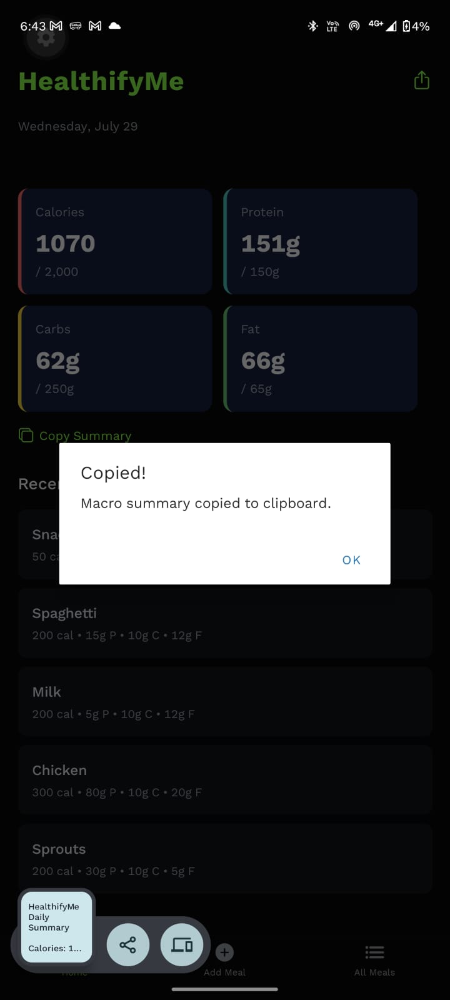

<div align="center">

# 🥗 HEALTHIFYME

A modern cross-platform nutrition tracking application built with **React Native**, **Expo**, **TypeScript**, and **AsyncStorage** to help users monitor their daily calorie and macronutrient intake through an intuitive and responsive interface.

<br/>


</div>

---

# 📋 Table of Contents

- [Introduction](#-introduction)
- [Screenshots](#-screenshots)
- [Features](#-features)
- [Tech Stack](#-tech-stack)
- [Installation](#-installation)
- [Running the Project](#-running-the-project)
- [Future Enhancements](#-future-enhancements)

---

# 🤖 Introduction

**HEALTHIFYME** is a cross-platform nutrition tracking application that enables users to log meals, monitor daily calorie and macronutrient intake, and manage their dietary habits through a clean, intuitive interface.

Built with **React Native**, **Expo**, and **TypeScript**, the application offers persistent local storage using **AsyncStorage**, smooth navigation with **Expo Router**, and a responsive mobile-first design for Android and iOS devices.

---

# 📱 Screenshots

<table align="center">
<tr>

<td align="center">
<b>🏠 Home</b><br/><br/>

</td>

<td align="center">
<b>➕ Add Meal</b><br/><br/>

</td>

<td align="center">
<b>📋 All Meals</b><br/><br/>

</td>

<td align="center">
<b>📤 Share Info</b><br/><br/>

</td>

<td align="center">
<b>📋 Copy Info</b><br/><br/>

</td>

</tr>
</table>

---

# 🔥 Features

### 🥗 Meal Tracking

Log daily meals with detailed nutritional information, including calories, protein, carbohydrates, and fat.

---

### 📊 Daily Nutrition Dashboard

Track total daily intake of:

- Calories
- Protein
- Carbohydrates
- Fat

---

### 📋 Meal History

Browse all recorded meals or quickly view recently added meals from the home screen.

---

### 📤 Share Nutrition Data

Share your meal summaries with others directly from the application.

---

### 📋 Copy Meal Information

Copy meal details instantly for quick sharing or note-taking.

---

### 💾 Persistent Local Storage

Store all meal records locally using AsyncStorage so data remains available across application restarts.

---

### 📱 Cross-Platform Support

Built with React Native and Expo for seamless performance on Android and iOS.

---

### 🎨 Modern Mobile UI

- Clean Interface
- Responsive Layout
- Smooth Navigation
- Mobile-First Design
- Intuitive User Experience

---

### ⚡ Fast Navigation

Powered by Expo Router for smooth screen transitions and file-based routing.

---

### 🔔 Smart Notifications

Supports reminder notifications to help users stay consistent with meal tracking.

---

### 📳 Haptic Feedback

Provides tactile feedback during user interactions for an improved mobile experience.

---

### 🏗️ Scalable Architecture

Designed with:

- Reusable Components
- TypeScript Interfaces
- Utility Functions
- Organized Folder Structure
- Modular Architecture

---

# ⚙️ Tech Stack

- React Native
- Expo
- Expo Router
- TypeScript
- AsyncStorage
- Expo Notifications
- Expo Haptics

---

# 🚀 Installation

Clone the repository.

```bash
git clone https://github.com/<your-github-username>/healthifyme.git

cd healthifyme
```

Install dependencies.

```bash
npm install
```

or

```bash
yarn
```

---

# ▶️ Running the Project

Start the Expo development server.

```bash
npx expo start
```

Run on Android.

```bash
npx expo run:android
```

Run on iOS.

```bash
npx expo run:ios
```

Or scan the QR code using **Expo Go** on your mobile device.

---

# 🚀 Future Enhancements

- ☁️ Cloud Synchronization
- 👤 User Authentication
- 📅 Weekly & Monthly Reports
- 📈 Nutrition Analytics
- 🎯 Personalized Diet Goals
- 🥤 Water Intake Tracker
- 🥦 Food Barcode Scanner
- 🌙 Light & Dark Theme
- 🍽️ Meal Categories
- 🤖 AI-Based Diet Recommendations

---

<div align="center">

### ⭐ If you found this project useful, consider giving it a star!

Made with ❤️ using **React Native**, **Expo**, **TypeScript**, and **AsyncStorage**.

</div>
